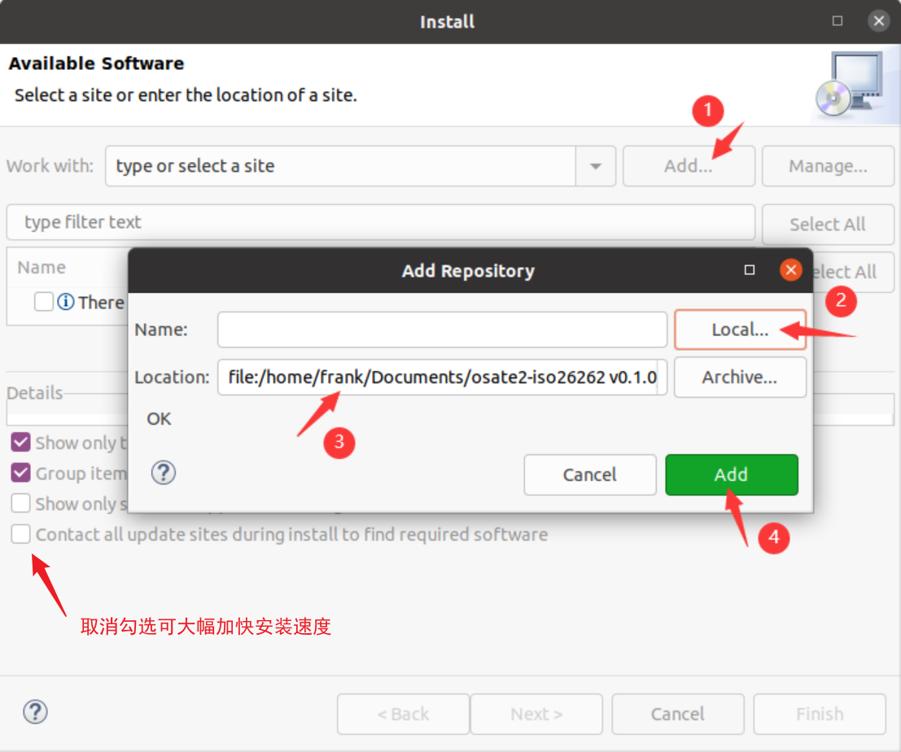
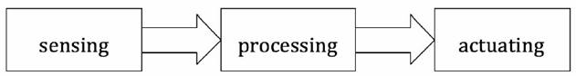
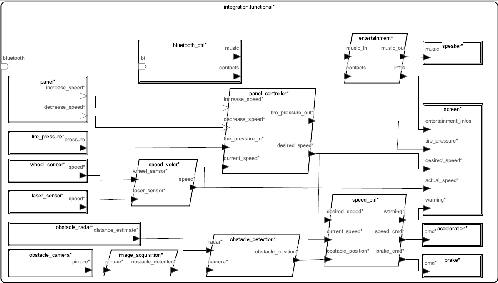
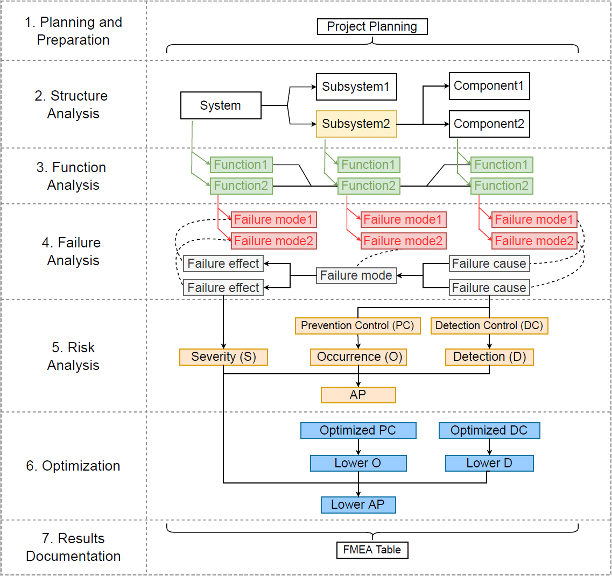
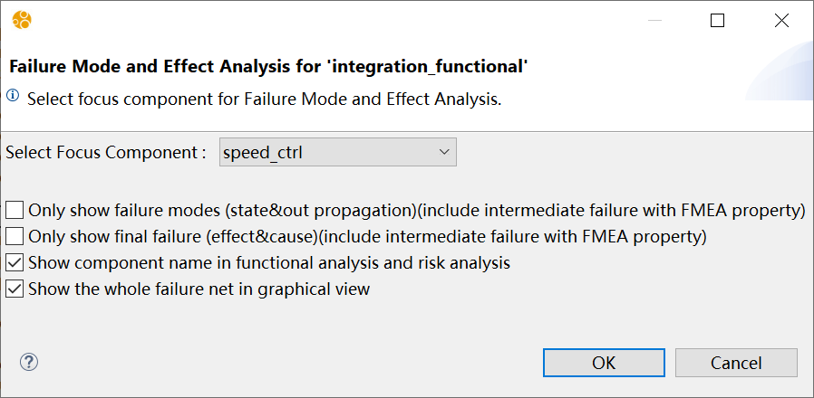

# OSATE2 ISO-26262 插件 用户文档

一款 [OSATE2](https://github.com/osate/osate2) 工具插件，可在 OSATE2 平台上实现使用 AADL 模型进行 ISO-26262 标准中提出的一些分析方法，如下：

- `FMEDA` (Failure Modes Effects and Diagnostic Coverage Analysis) - 失效模式影响与诊断分析
- `FMEA` (Failure Modes and Effects Analysis) - 失效模式与影响分析
- `HARA` (Hazard Analysis and Risk Assessment) - 危害分析与风险评估

## 插件安装

1. 在 `release` 文件夹内获取最新的插件压缩包 `osate2-iso26262.v0.1.7.zip` 并解压。

2. 打开 OSATE2 (***version >= 2.11.0***) 工具，在顶层工具栏 `Help` -> `Install New Software` -> `Add` -> `Local` -> 浏览并选中上一步骤中解压得到的文件夹 -> `Add` -> 勾选插件 -> `Next` -> `Finish`，等待工具进行依赖检查及安装。

    

3. 如遇安装过程中弹窗，选择 `Trust all unsigned content`，重启 OSATE2 工具完成安装。

有关插件安装的更多细节可以参考 `doc/video/插件安装与示例项目.mp4` 视频文件。

## 示例项目

本插件包含一个示例项目，该示例项目取自 [*AADL In Practice*](http://julien.gunnm.org/aadl-book)。

### 示例简介

我们通过一个简单的自动驾驶汽车系统的案例来说明如何使用本插件在AADL进行安全分析。

我们的目的是专注于一些安全攸关特性，并展示本插件如何帮助分析它们和设计实时、安全关键的系统。

自动驾驶汽车系统在汽车运行时捕捉图片，以探测道路上的障碍物。它使用两个速度传感器来检测实际车速并启动加速或制动功能。如果检测到有障碍物进入，汽车就会启动刹车（其力度会根据汽车与障碍物的距离而变化）。如果没有障碍物，可以启动加速功能。该车还包括娱乐功能（如音乐）和一个向乘客提供反馈的屏幕（如实际速度、期望速度）。乘客还可以使用一个面板设置所需的速度。据称，新车与乘客的设备（如手机或平板电脑）连接并互动。

障碍物检测和速度调节是关键功能，必须以实时、确定性的方式运行。系统必须满足安全性：

- 娱乐系统的故障不能导致制动和加速功能的故障。
- 速度传感器是冗余的，只有一个速度传感器的故障不能阻止汽车运行。

我们使用一个通用的系统实现（称为功能模型）来定义AADL模型，该模型后来被细化为两个包括部署问题的变体。通用模型包含了两种架构的所有共同元素。这个通用模型与部署无关：它定义了实现系统的设备和软件组件（如进程），但没有定义执行平台（如处理器、内存或总线）。架构的所有元素都被连接起来，并交换AADL数据组件所定义的数据类型。

功能模型定义了用于实现系统的不同软件和硬件组件。这个案例研究的系统遵循一个通用的传感/处理/执行模式： 

1. 一些传感器产生数据（例如，速度、障碍物探测）。
2. 这些数据由一些软件组件处理，然后发送给执行器。
3. 执行器根据处理功能的数据被激活（例如，加速或刹车）。



 

以下的AADL组件构成了传感功能：

- `obstacle_camera`：自驾车的摄像头（用AADL设备组件捕获）。它将原始图片发送到一个软件组件（`image_acquisition`），该组件检测是否有一个道路上的障碍物。这是该系统的一个关键元素。
- `obstacle_radar`：一个探测道路上障碍物的雷达（用AADL device组件指定）。它直接向`obstacle_detection`组件发送数据，该组件使用来自摄像机的处理过的数据来检测道路上是否有障碍物。这是该系统的一个关键元素。
- `wheel_sensor`：位于车轮上的传感器，用于指示车辆速度（用AADL设备组件捕获）。这是该系统的一个关键元素。
- `laser_sensor`：另一个使用激光技术来提供车速的传感器（用AADL设备组件捕获）。该传感器与`wheel_sensor`是冗余的： 如果车轮传感器发生故障，可以使用这个值。
- `bluetooth_ctrl`：一个从蓝牙总线接收数据的设备。它与娱乐系统对接，控制汽车的音乐，并从手机上获得联系人和数据。 
- `tire_pressure`：一个将轮胎压力传送给`panel_controller`组件的设备。这提供了检测低胎压的能力，并向驾驶员发送低胎压或爆胎警告。
- `panel`：位于方向盘上的一个装置，用于增加和减少汽车的速度。它向`panel_controller`发送信号，后者最终将命令传达给控制汽车速度的部件。这本身并不是一个关键部件：如果发生一些意外情况（例如，系统不适当地启动加速），软件可以检测到它并防止潜在的危险行为。

以下组件构成了系统的处理部分，并依赖于软件组件：

- `image_acquisition`：使用摄像机的原始数据来确定是否存在障碍物
- `obstacle_detection`：使用来自`image_acquisition`和`obstacle_radar`的数据确定道路上是否有实际的障碍物。这个组件的作用类似于图像采集的冗余/投票系统。
- `speed_voter`：接收来自两个传感器的速度，消除潜在的坏值（由于传输错误，一个传感器的故障，等等），并输出一个一致的速度值，该值将被速度控制器使用并显示在屏幕上。
- `speed_ctrl`：使用来自乘客的期望速度、实际速度和来自障碍物探测器的信息，适当地启动加速或制动。
- `entertainment`：接收来自蓝牙控制器的数据（联系人和音乐），并发送音乐到扬声器，以及显示在仪表板屏幕上的信息。
- `panel_controller`：从面板上获得信息（加速或制动功能是否被激活），实际速度和轮胎压力。然后这个组件产生所需的速度和信息，显示在仪表盘屏幕上。

最后，以下组件代表系统的执行部分：

- `brake`：对汽车车轮实施制动的装置
- `acceleration`：调整发动机并提高车速的装置
- `speaker`：汽车音响系统的输出，产生声音的地方
- `screen`：仪表盘上的屏幕

**下图是AADL模型的图形表示:**



### 示例导入

打开 OSATE2 工具，在顶层工具栏 `File` -> `New` -> `Example` -> `AADL Examples `  -> `ISO26262 Examples`  -> `Automated Driving System` -> `Finish`，即可在项目栏看到生成的示例项目。

 

## 插件使用

**注：使用下文中提到的各类属性集时需先在对应 aadl 文件中使用 `with ISO26262` 语句引入插件库。**

### HARA分析

ISO 26262 基于V模型，汽车功能安全开发活动始于概念阶段，该阶段主要包含相关项定义、危害分析和风险评估还有功能安全方案开发。

其中，HARA也就是Hazard Analysis and Risk Assessment是在概念阶段导出功能安全目标及其ASIL等级的系统安全分析方法。

具体而言，根据相关项定义的功能，分析其功能异常表现，识别其可能的潜在危害及危害事件，并对其风险进行量化，即确定`ASIL`等级，导出功能安全目标和`ASIL`等级，以此作为功能安全开发最初最顶层的安全需求。

#### 属性集

通过对系统模型进行危害分析和风险评估，识别出需要防止、减轻或控制的危害和危害事件，并将汽车安全完整性等级(`ASIL`)与每个安全需求关联。

安全目标在功能安全产品开发中，相当于相关项最高层级的功能安全需求。因此安全目标和功能安全需求一样，包含`ASIL`等级、`FTTI`、`safe state`等属性。

执行HARA分析需要用到的属性集。

**`ISO26262::Hazards`**

	-- 严重度、可控度、暴露度、ASIL、安全需求标签： 用在ISO26262::Hazards属性中。
	SeverityLabels: type enumeration (S0, S1, S2, S3);         
	ControllabilityLabels: type enumeration (C0, C1, C2, C3);	
	ExposureLabels: type enumeration (E0, E1, E2, E3, E4);	
	ASILLabels: type enumeration (QM, A, B, C, D);						
	SafetyRequireCategory: type enumeration (SG, FSR, TSR, HSR, SSR);	
	   	
	Hazards:  list of record (
		-- 第一部分	--
		HazardName: aadlstring;				-- 危害的名称/FMEA中故障模式的名称
		Description: aadlstring;			-- 危害的描述
		Mishap: aadlstring;					-- 危险事件的描述 ( 危险事件 = 危险 + 环境 )
		Environment: aadlstring;			-- 危险事件的环境描述
		VerificationMethod: aadlstring;		-- 处理危险的验证方法
		CrossReference: aadlstring;			-- 外部文件的交叉引用
		Comment: aadlstring;				-- 关于危害的附加信息
		Probability: aadlreal 0.0 .. 1.0;	-- 故障模式发生的概率
		-- 第二部分	--
		Severity: ISO26262::SeverityLabels;	-- ISO26262中的严重程度指数
		SeverityComment: aadlstring;		-- 关于严重度的附加信息
		Exposure: ISO26262::ExposureLabels;	-- ISO26262中的暴露度指数
		ExposureComment: aadlstring;		-- 关于暴露度的额外信息。
		Controllability: ISO26262::ControllabilityLabels;-- ISO26262中的可控度指数
		ControllabilityComment: aadlstring;	-- 关于可控度的额外信息
		ASIL: ISO26262::ASILLabels;			-- 汽车安全完整性等级
	    -- 第三部分	--
		SafetyDescription: aadlstring;		-- ISO26262中安全要求的描述/FMEA中的功能描述
		SafetyCategory: ISO26262::SafetyRequireCategory;-- ISO26262中的安全需求
		OperatMode: aadlstring;		-- 一个项目或元素的使用和应用所产生的功能状态的条件。
		FTTI: Time;					-- 容错的时间间隔
		SafeState: aadlstring;		-- 项目在发生故障时的运行模式，没有不合理的风险水平
		MissionTime: Time;-- 计算安全目标故障率的任务时间（如果是硬件，为硬件随机故障率PMHF)
	)applies to ({emv2}**error type, {emv2}**type set, {emv2}**error behavior state,
		{emv2}**error propagation, {emv2}**error event, {emv2}**error flow);

该属性定义了危害的描述与ISO26262对危害的评估指标，可以将该属性集赋予各组件EMV2 ANNEX中的相关故障元素。

该记录主要分为三大部分：

- 第一部分是针对危害和危害事件的属性，其中包括危害名，危害描述，场景描述，以及危害事件描述。

  同时我们还参考了其他几个标准的属性集，增加了处理危害的验证方法，对外部文档的参考引用等属性。

- 第二部分是对危害事件分类的属性，其中有计算ASIL等级时用到的严重度，暴露度，可控性，以及他们的描述。

  危害事件所反映安全需求的ASIL等级是继承该危害事件的ASIL等级的

- 第三部分是对安全需求设计的属性，包括安全目标的描述，运行模式，故障容错时间间隔，安全状态等。

#### 分析步骤

1. 使用 `ISO26262::hazards` 为系统各组件`EMV2 ANNEX`中视为危害的相关故障元素添加危害描述（如`ErrorBehaviorState` 或 `ErrorPropagation`）。

2. 实例化模型文件并使用插件进行HARA分析，插件会分析模型中附有`ISO26262::hazards`属性的故障元素。

   若其`Severity`、`Exposure`、`Controllability`度量指数存在，插件会自动计算评估其汽车安全完整性等级`ASIL`。

3. 插件最终会将所有的hazards属性，以及自动计算的`ASIL`以EXCEL表格的形式输出到实例化文件.aaxl2的相对路径`./reports/hazard`的文件夹中。

具体执行步骤可以参考 `doc/video/HAZARD分析实例演示.mp4` 视频文件。

### FMEA分析

新的AIAG-VDA DFMEA在分析步骤中增加了对系统结构、功能和风险分析的考虑，从而使FMEA的开发过程更加健全。DFMEA分析过程由七个步骤组成。

 

#### 属性集

为了提供全面的FMEA分析，除了**`ISO26262::Hazards`**属性支持FMEA中的功能分析与故障分析以外，我们还需要额外的属性集，用于提供附加在AADL组件和错误元素上的额外信息。

- `ISO26262::FmeaHead`：赋予顶层组件，用于记录FMEA表头信息，以及本次分析的焦点组件，以支持FMEA流程的规划与准备步骤。
- `ISO26262::Hazards`：赋予系统相关组件的故障元素，添加故障描述及其违反的功能（安全需求），以支持FMEA流程功能分析步骤与故障分析步骤。
- `ISO26262::FmeaRiskAnalysis`：赋予系统相关组件的故障元素，添加对该故障当前的探测/预防措施，及其度量指标(S/O/D)，以支持FMEA流程功能风险分析步骤。
- `ISO26262::FmeaOptimization`：赋予系统相关组件的故障元素，添加对该故障优化后的探测/预防措施，优化后的度量指标(O/D)，以及其他额外信息，以支持FMEA流程功能优化分析步骤。

**必须注意的是，即使没有通过ISO26262属性集记录额外的信息，完成架构建模和错误建模的AADL模型也可以进行FMEA的结构分析和核心的故障分析步骤。**

```c
	FmeaHead: record (
		CompanyName: aadlstring; 					-- 公司名称		
		EngineeringLocation: aadlstring; 			-- 工程地点	
		CustomerName: aadlstring; 					-- 顾客名称			
		ModelYearProgram: aadlstring; 				-- 年型/项目 	
		Subject: aadlstring; 						-- 项目				 	
		DFMEAStartData: aadlstring; 				-- DFMEA启动日期	
		DFMEARevisionData: aadlstring; 				-- DFMEA修订日期
		CrossFuncTeam: aadlstring; 					-- 跨功能团队
		DFMEAID: aadlstring; 						-- DFMEA ID 编号		
		DesignResponsibility: aadlstring; 			-- 设计职责
		ConfidentialityLevel: aadlstring; 			-- 保密级别
		FocusComponent: aadlstring; 				-- 焦点组件	
	)applies to (all);
	
	FmeaRiskAnalysis: record (	
		Severity: aadlinteger 1 .. 10;				-- 失效影响的严重度S
		PC: aadlstring;								-- 当前对失效原因的预防措施
		Occurrence: aadlinteger 1 .. 10;			-- 失效原因的发生度O
		DC: aadlstring;								-- 当前堆失效模式/失效原因的探测措施
		Detection: aadlinteger 1 .. 10;				-- 失效模式/失效原因的探测度D
	)applies to ({emv2}**error type, {emv2}**type set, {emv2}**error behavior state,
	{emv2}**error propagation, {emv2}**error event, {emv2}**error flow);

	FmeaOptimization: list of record (
		OptPC: aadlstring;							-- DFMEA优化的预防措施
		OptDC: aadlstring;							-- DFMEA优化的探测措施
		OptOccurrence: aadlinteger 1 .. 10;			-- 优化后的发生度O
		OptDetection: aadlinteger 1 .. 10;			-- 优化后的探测度D
        ResponsPerson: aadlstring;					-- 负责人姓名
		TargetCompletionData: aadlstring;			-- 目标完成时间
		Status: aadlstring;							-- 状态
		Evidence: aadlstring;						-- 采取的行动的证据
		CompletionData: aadlstring;					-- 实际完成时间
		Notes: aadlstring;							-- 备注
	)applies to ({emv2}**error type, {emv2}**type set, {emv2}**error behavior state,
    {emv2}**error propagation, {emv2}**error event, {emv2}**error flow);
		
```

#### 分析步骤

1. 完成AADL中的系统**体系架构建模**与各组件的EMV2**故障建模**。

2. 为系统相关故障元素（如`ErrorBehaviorState` 或 `ErrorPropagation`）添加FMEA相关属性。

3. 实例化模型文件并使用插件进行FMEA分析，插件会分析模型体系架构模型与故障模型，并读取相关属性进行DFMEA七步法流程进行分析。

   1. 在规划和准备步骤中，必须建立一个项目计划和时间表。这一步包括组建DFMEA团队，汇编必要的文件和资源。该步骤以DFMEA表头的形式组织。DFMEA团队和项目规划应以DFMEA表头的形式来组织。这些信息可以作为一个`aadlstring`类型放在`ISO26262::FmeaHead`记录中，并赋予AADL中的顶层系统，如`integration.functional`。在这一步，我们应该选择一个子系统或组件作为焦点组件，随后的分析步骤将围绕它展开。

   2. 在结构分析步骤中，模型通过层次关系被细分为系统、子系统和组件，并以结构树的形式表示。AADL提供了一套标准的构件抽象，例如：用于软件构件的`thread`、`thread group`、`process`、`data`和`subprogram`；用于硬件构件的`processor`、`memory`、`device`和 `bus`；以及作为复合构件的`system`。我们可以在AADL的组件实现中使用 subcomponents声明来表达系统的层次关系。关键是要注意，结构必须根据系统的功能交互形式来构建。这一步的结果将以焦点组件（`Focus Component`）为中心，其上层和下层组件分别在左边和右边的表格中呈现。

   3. 第三步功能分析和第四步故障分析要求我们确定每个系统组件的功能和故障模式，以建立功能网和故障网。系统根据其功能被分解成各种组件。失效模式是由组件的功能得出的，其中可能包括功能损失、功能退化和非预期功能。图x显示，功能网描述了组件之间的功能依赖性，而故障网说明了每个组件的故障模式之间的因果关系。通常情况下，故障分析是在功能分析之后进行的。这两个过程都是独立进行的，这可能导致两个分析结果之间的不一致。在故障网中具有因果关系的两个故障模式在功能网中可能没有依赖关系。值得注意的是，功能网中一个功能的失效将不可避免地使依赖于它的其他功能失效。因此，插件首先启动故障分析，获得系统的故障网。接下来，故障网中的每个故障模式节点都被替换成其对应的被违反的组件功能。最后，相同的功能节点被合并以完成从故障网到功能网的转换。

      AADL使用EMV2来模拟组件的故障行为。AADL中的错误模型是一种状态机，它规定了一个组件的状态如何响应事件或其他组件的状态而变化。在EMV2中，我们将故障模式表示为`error behavior states`。`error behavior states`被指定为错误行为状态机的一部分。`Error events`是导致组件从正常状态过渡到故障模式的内部触发器。故障模式的影响是它向其他组件的传播以及它们对这种传播的响应。错误的传出传播不仅可以由组件进入错误状态引起，也可以由错误的传入传播引起。因此，一些组件可能没有任何内部错误行为，只有在其错误模型中定义了出错传播，以表明可以向外传递的错误类型。在这种情况下， `out propagation`可以被视为一种故障模式。我们使用`ISO26262::Hazards`记录为组件添加故障描述及其违反的功能（安全需求）

      从焦点组件的角度来看，导致焦点组件进入故障模式的故障模式被视为故障原因。相反，受焦点部件故障模式影响的故障模式被认为是故障效应。

      失效模式的影响可分为两类： 

      - 影响同一系统层次的其他组件的故障模式的，`connections`和`bindings`可以确定组件之间的错误传播路径。

      - 影响上层组件的故障模式的，通过在组件中定义`composite error behavior`，用户可以根据其子组件的错误状态来定义组件处于特定错误状态的条件。

      为了开始故障分析，我们首先遍历所有的系统组件，分析每个未分析的故障模式的故障影响，得到多个故障传播链。然后，我们将所有具有相同故障模式的节点合并，得到一个完整的故障网。

   4. 在第四步风险分析中，有必要对`Focus Component`的每个故障模式、故障原因和故障影响进行评价，以评估风险。评估风险的评价标准是基于三个因素：

      - `Severity`（S）：代表故障影响的严重程度。

      - `Occurrence`（O）：代表故障原因的频率。

      - `Detectability`（D）：代表发生的故障原因和故障模式的可检测性。

      S、O和D的等级为1-10，10为最高风险等级。风险分析中包括两种主要类型的措施。

      - 预防措施描述了现有的和计划中的行动如何减轻导致故障模式的故障原因，为确定发生率等级提供了基础。

      - 探测措施在项目交付生产前检测是否存在故障原因或故障模式，为确定检测程度提供依据。

      与风险优先级数（RPN）将S、O和D乘以相同的权重不同，AP根据特定的规则将系统风险分为高、中、低三类，并对每种风险的改进措施进行指导。AP有几个优点，如客观反映风险的严重程度，更加关注高风险的故障模式，以及对不同情况的适应性。相关信息可以通过`ISO26262::FmeaRiskAnalysis`记录列表属性分配给相关故障原因。

   5. 第六步优化步骤是根据风险分析结果决定是否优化风险。假设在审查当前措施的有效性或风险评估的过程中没有取得令人满意的结果。在这种情况下，可以制定进一步的预防和检测措施来减少O和D，从而降低AP的评估等级。优化步骤可以多次进行，相关信息可以通过`ISO26262::FmeaOptimization`记录列表属性分配给相关故障原因。

   6. 第七步结果文件化包括记录结果、总结、报告和交流。FMEA工具会自动生成一个包含所有分析结果的EXCEL表格。

4. 插件最终会将FMEA表格以EXCEL表格的形式输出到实例化文件.aaxl2的相对路径`./reports/fmea`的文件夹中。

#### 执行分析

1. 选中目标组件的实例化文件(.aaxl2)。

2. 在顶层工具栏 `Analyses` -> `ISO 26262` -> `Run Failure Mode Effect and Analysis`。

3. 选择要分析的焦点组件（插件首先会自动选择顶层组件记录属性`ISO26262::FmeaHead[FocusComponent]`的组件为焦点组件）。

4. 勾选分析相关选项

   - `Only show failure modes...` : 勾选后在故障分析中将只输出故障影响传播中的`error state`和`error out propagation`以及其他额外添加FMEA属性的故障信息。

   - `Only show final failure...` : 勾选后在故障分析中将只输出故障影响传播中最根本的故障影响和最初始的故障原因。
   - `Show component name...` : 勾选后在功能分析和故障分析的单元格中展示相关元素的组件名。

   - `Show the whole failure net...` : 勾选后将创建一个新的图形界面展示系统完整的故障网络。

   

5. 点击 `OK` 执行分析，插件会弹出“FMEA report generation complete”表示分析过程结束。

6. 分析报告将在项目的 `./instances/reports/fmea` 目录下生成。 

具体执行步骤可以参考 `doc/video/FMEA分析实例演示.mp4` 视频文件。

### FMEDA分析

#### 属性集

执行 FMEDA 分析需要使用到两个属性集。

**`ISO26262::FMEDASafetyProperties`**

```c
FMEDASafetyPropertiesSpecification : type record (
	FailureRate : aadlreal;       -- 组件的失效率，单位FIT
	SafetyRelated : aadlboolean;  -- 组件失效是否与安全目标相关
);
```

该属性定义了组件的失效率和安全相关信息，使用该属性集需要为组件创建一个特殊的 `ErrorBehaviorState` ：`FmedaState` 并将属性集绑定其上。

**`ISO26262::FailureMode`**

```c
FailureModeSpecification: type record (
	ModeName: aadlstring;     -- 失效模式名
	Distribution : aadlreal;  -- 在所有失效模式中的占比
		
	-- 单点故障
	Violate_SP_Satety : aadlboolean;  -- 是否可能存在单点故障
	SPF_SM : aadlstring;  -- 单点故障诊断方法
	SPF_DC : aadlreal;    -- 诊断覆盖率
		
	-- 多点故障
	Violate_MP_Satety: aadlboolean;  -- 是否可能存在多点故障
	MPF_SM : aadlstring;  -- 多点故障诊断方法
	MPF_DC : aadlreal;	  -- 诊断覆盖率
);
```

该属性定义了组件的某个失效模式信息，使用该属性集需要将其绑定至对应的 `ErrorBehaviorState` 或 `ErrorPropagation` 上，一个组件可以含有一个或多个故障模式。

#### 分析步骤

1. 使用 `ISO26262::hazards => ([SafetyDescription => ...])` 标签为模型顶层组件添加安全目标。
2. 为系统添加必要的 FMEA 属性构建故障网、功能网  **(仅选择依赖 FMEA 辅助分析的模式下需要此步骤)**。
3. 为相关组件添加 FMEDA 属性。
4. 执行分析。

#### 执行分析

1. 选中目标组件的实例化文件(.aaxl2)。

2. 在顶层工具栏 `Analyses` -> `ISO 26262` -> `Run Failure Mode Effect and Diagnostic Analysis`。

3. 选择要分析的安全目标与目标安全等级。

4. 勾选分析选项

   - `Do analysis with FMEA` : 勾选后将借助 FMEA 分析提供的故障网进行辅助分析，但需要优先提供 FMEA 相关属性集；若不勾选将遍历系统中所有拥有合法 FMEDA 属性的组件进行分析

   - `Export CSV report` : 勾选后分析报告将以 CSV 格式输出，默认以 Excel 格式输出

    

5. 点击 `OK` 执行分析，若检测到不合法的 FMEDA 属性集插件会弹出提示。

6. 分析报告将在项目的 `./instances/reports/fmeda` 目录下生成。 

有关 FMEDA 分析的更多细节可以参考 `doc/video/FMEDA分析实例演示.mp4` 视频文件。

