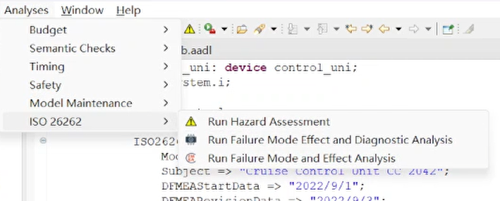

# Automated Driving System Example

This example reproduces the Automated Driving System described in the *AADL In Practice*. It was originally designed to demonstrate the following capabilities of *OSATE2 ISO-26262 plugin*:

* Failure Modes Effects and Diagnostic Coverage Analysis (FMEDA)
* Failure Modes and Effects Analysis (FMEA)
* Hazard Analysis and Risk Assessment (HARA)

A complete description of the case-study is available in [AADL In Practice](http://julien.gunnm.org/aadl-book).

This README is based on OSATE 2.11.0.

### Organization of the example

The integration.aadl is the main AADL module.

### Conducting analysis

To analyze the model start by right clicking on one of the implementations in the Outline perspective and select "Instantiate". The instantiation is placed in the instance folder within the model in the AADL Navigator. 

 

Click the instantiation (e.g., integration_integration_functional_Instance.aaxl2) and then select the desired analysis (e.g., from the Analyses menu).

